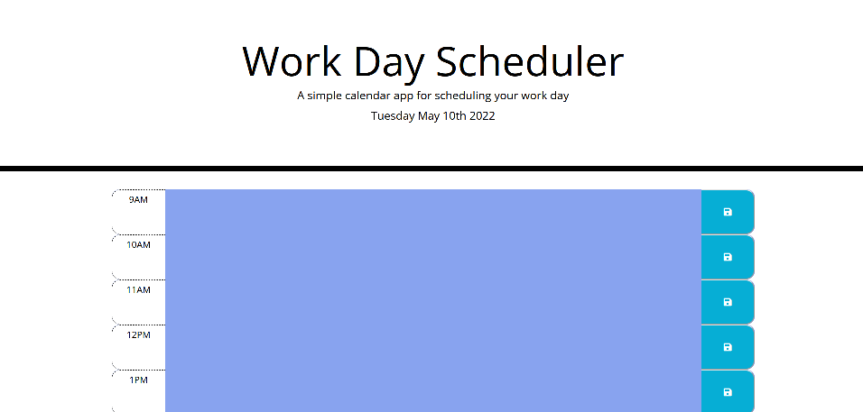

# Work-day-scheduler

For this project we had to create a simple day planner which allows the user to save events throught a normal working day. 

A number of features were used in creation of this planner:

* HTML
* CSS
* Moment.js
* JQuery

The main functionality of the planner is to record events through working hours (9am-5pm). To then be able to save such events in the local storage so that upon refreshing the page the events are still listed on the correct time blocks. The time blocks are colour coded to indicate whether the time blocks are currently in present time, past or future. 

Below shows the preview of the planner and also the blue indicates that the times are in the past. The planner also displays the current date with the day as well.

Website link: https://keyurmist.github.io/Work-day-scheduler/

